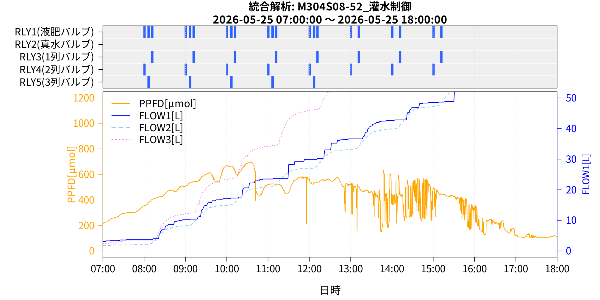

# スイッチログ統合解析ツール

制御ノード（窓・カーテン・灌水・空調など）のリレー開閉ログと環境センサデータを重ねて可視化するRスクリプトです。

## 出力イメージ



上段にリレーの開閉状態（青＝ON）、下段に環境センサデータを重ねて表示します。
PDF ファイルとしてノードのデータディレクトリに出力されます。

---

## ファイル構成

```
作業ディレクトリ/
├── analyze_switch_log_v10.R   # メインスクリプト（変更不要）
├── plot_func10.R              # グラフ描画関数（変更不要）
├── config.R                  # デフォルト設定ファイル
├── config_xxx.R              # 環境別設定ファイル（任意）
│
├── m304s08/                  # ノードごとのデータディレクトリ
│   ├── cnd.nmc               # リレー開閉ログ（複数日をまとめたもの）
│   ├── m302n10.csv           # 環境センサCSV
│   ├── tb2n1.csv
│   └── ...
│
└── m304s04/
    ├── cnd.nmc
    └── ...
```

### データディレクトリ名のルール

`node_name` の最初の `-` より前を小文字にしたものになります。

| node_name | データディレクトリ |
|---|---|
| `M304S08-52_灌水制御` | `./m304s08` |
| `M304S04-48_窓系制御` | `./m304s04` |

---

## 設定ファイル（config.R）

**Rコード本体は一切触らず、このファイルだけを編集します。**

```r
# 解析対象ノード（node_settings の node_id）
# NA にすると起動時に一覧から選択
NODE_ID <- 5

# Google スプレッドシート
SHEET_ID    <- "YOUR_SHEET_ID"   # スプレッドシートID
GID_NODE    <- "0"               # node_settings シートの gid
GID_CHANNEL <- "1209898986"      # channel_settings シートの gid

# フォント（環境に合わせて変更）
# macOS  : "HiraginoSans-W3"
# Ubuntu : "Noto Sans CJK JP"
# Windows: "Yu Gothic"
MY_FONT <- "Noto Sans CJK JP"

# 上段グラフに表示するリレー番号（1〜8）
TARGET_RELAYS <- 1:5
```

複数の環境を使い分ける場合は `config.R` を複製して環境別ファイルを用意します。

```
config_温室A.R
config_温室B.R
config_宮崎.R
```

---

## Google スプレッドシートの設定

ノード設定とチャンネル設定を1つのスプレッドシートで管理します。

sample_data/M304_analyze_data.ods にサンプルを呈しますが、こういう形式でGoogleスプレッドシートにインポートしてください。  
このシートの内容はフィクションデータです。


### 共有設定（必須）

スプレッドシートを「**リンクを知っている全員が閲覧可**」に設定してください。
非公開のままだと `401 Unauthorized` エラーになります。

### シート構成

**`node_settings` シート**

| node_id | node_name | r1 | r2 | ... | r8 |
|---|---|---|---|---|---|
| 5 | M304S08-52_灌水制御 | 液肥バルブ | 真水バルブ | ... | 空き |

**`channel_settings` シート**

下段グラフに描画する環境データを定義します。

| 列名 | 内容 | 例 |
|---|---|---|
| `node_id` | 対象ノードのID | `5` |
| `panel` | 描画パネル（現在は `bottom` のみ） | `bottom` |
| `ch` | チャンネル番号 | `1` |
| `file` | CSVファイル名（データディレクトリからの相対パス） | `m302n10.csv` |
| `col` | CSV内の列名 | `InRadiation` |
| `label` | 軸ラベル | `PPFD[μmol]` |
| `color` | 線の色 | `orange` |
| `axis` | 軸の位置（`left` または `right`） | `left` |
| `ymin` | 軸の最小値 | `0` |
| `ymax` | 軸の最大値 | `1200` |
| `lty` | 線種（1=実線, 2=破線, 3=点線） | `1` |
| `active` | 1=描画する, 0=スキップ | `1` |

`active` を `0` にするだけで一時的に非表示にできます（行削除不要）。

環境ごとに `channel_settings_温室A`、`channel_settings_宮崎` などのシートを用意し、`config.R` の `GID_CHANNEL` を切り替えるだけで対応できます。

### gid の確認方法

スプレッドシートのシートタブを開いたときのURLの `?gid=` の数字です。

```
https://docs.google.com/spreadsheets/d/XXXX/edit?gid=1209898986
                                                      ^^^^^^^^^^
```

---

## 実行方法

### 基本

```bash
Rscript analyze_switch_log_v10.R "2026-05-24 07:00:00" "2026-05-24 18:00:00"
```

`config.R` の `NODE_ID` で指定したノードを解析します。

### 環境別 config を指定

```bash
Rscript analyze_switch_log_v10.R config_宮崎.R "2026-05-24 07:00:00" "2026-05-24 18:00:00"
```

### 対話モード（日時を省略）

```bash
Rscript analyze_switch_log_v10.R
```

開始・終了日時の入力を求めるプロンプトが表示されます。
`NODE_ID` が `NA` の場合はノード選択も対話で行います。

---

## ログファイル形式（cnd.nmc / cnd.chg）

```
:::(skipped 4543 stable rows):::   # 変化なし期間の省略
2026-05-24 08:55:58,4              # 日時,リレー状態値
2026-05-24 08:55:59,0x4            # 0x形式・10進数どちらも可
2026-05-24 08:55:59,IGNORE DHCP   # ネットワークイベント（自動スキップ）
---                                # ブロック区切り
```

リレー状態値はビットフラグです。リレー N が ON のとき、2^(N-1) のビットが立ちます。

| 値 | リレー状態 |
|---|---|
| `0` | 全OFF |
| `1` (= 2^0) | RLY1 のみ ON |
| `4` (= 2^2) | RLY3 のみ ON |
| `5` (= 2^0 + 2^2) | RLY1 と RLY3 が ON |

複数日分のファイルを結合して `cnd.nmc` として置いてください。

```bash
cat 20260521-cnd.nmc 20260524-cnd.nmc 20260525-cnd.nmc > cnd.nmc
```

`cnd.nmc` がない場合は `cnd.chg`（旧形式）を自動的に使用します。

---

## R 実行環境のインストール

このプログラムは `Rscript` コマンドで実行します。RStudio は不要です。

### Linux（Ubuntu / Debian）

```bash
sudo apt update
sudo apt install r-base
```

インストール確認：

```bash
Rscript --version
```

日本語PDF出力に必要な cairo と日本語フォントも合わせてインストールしてください。

```bash
sudo apt install libcairo2-dev fonts-noto-cjk
```

### Windows

1. [https://cran.r-project.org/bin/windows/base/](https://cran.r-project.org/bin/windows/base/) からインストーラをダウンロード
2. インストーラを実行（デフォルト設定のままでOK）
3. インストール後、`Rscript` にパスが通っているか確認

```cmd
Rscript --version
```

パスが通っていない場合は環境変数 `PATH` に `C:\Program Files\R\R-x.x.x\bin` を追加してください。

Windows では日本語フォントとして「Yu Gothic」が標準で使えます。`config.R` の `MY_FONT` を合わせて変更してください。

```r
MY_FONT <- "Yu Gothic"
```

---

## 動作に必要なパッケージ

追加パッケージは不要です。ただし日本語PDFの出力には **cairo** が必要です。

```bash
# Ubuntu の場合
sudo apt install libcairo2-dev
```

---

## トラブルシューティング

**`401 Unauthorized` エラー**
スプレッドシートの共有設定を「リンクを知っている全員が閲覧可」に変更してください。

**上段グラフが空白になる**
`cnd.nmc` に指定した日時範囲のデータが含まれていない可能性があります。
該当日のログファイルを `cnd.nmc` に結合してください。

**`[skip] ファイルなし`** と表示される
`channel_settings` の `file` 列に指定したCSVファイルがデータディレクトリに存在しません。
ファイル名を確認するか、`active` を `0` に設定してスキップしてください。

**日本語が文字化けする**
`config.R` の `MY_FONT` を実行環境にインストールされているフォント名に変更してください。
